# Study Udacity

This project is for me to put everything I studied in this course: [Developing Android Apps with Kotlin by Google](https://www.udacity.com/course/developing-android-apps-with-kotlin--ud9012)

### Dice Roller
I developed an app called "Dice Roller", where it is an application that I roll 6-sided dice.

Dice Roller app start | Dice Roller app Roll
--- | ---
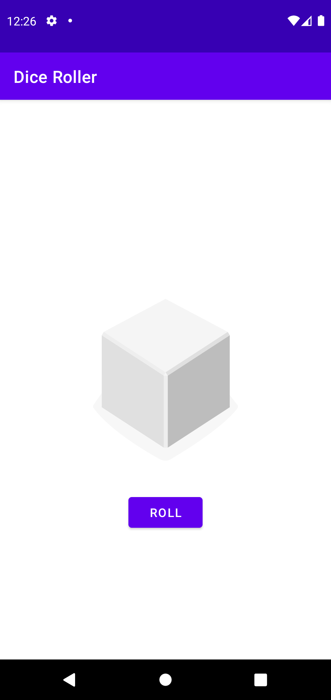 | 

### About Me
I developed about Binding, styles and how to hide a keyboard in this app.
About Me edit text | About Me hide button and keyboard
--- | ---
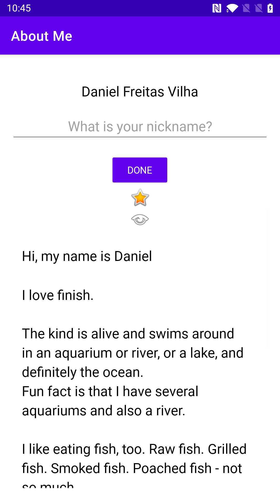 | 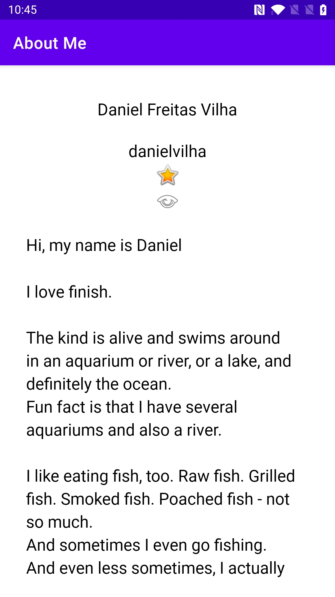

### Color My Views
I designed my application with a good user experience called ColorMyViews, with basic UI layout design. and with the types of visualization in ConstraintLayout.
ColorMyViews start | ColorMyViews Colored | ColorMyViews Colored More
--- | --- | ---
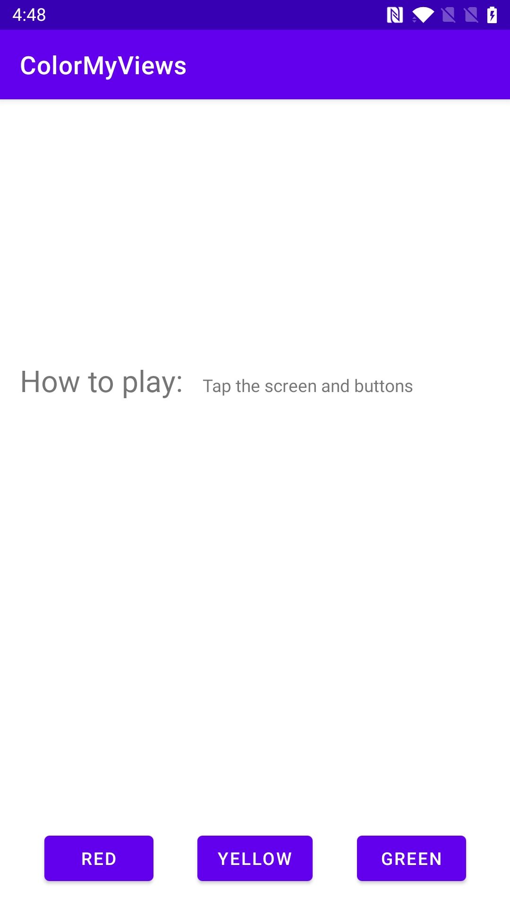 | 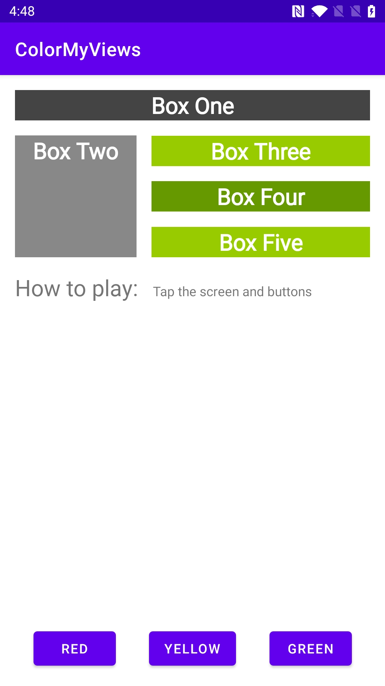 | 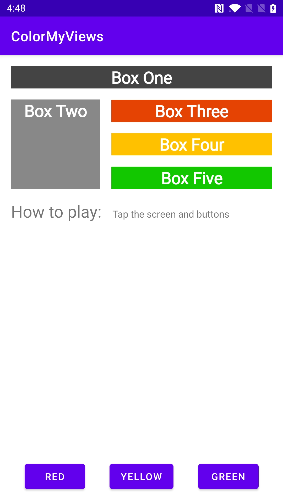

### Trivia
I built a multi-screen Android app with the navigation library. This is a trivia app using various fragments and conditional navigations.
Trivia app start | Trivia app menus | Trivia app About | Trivia app Rules | Trivia app trivia | Trivia app Game Won | Trivia app Game Over
--- | --- | --- | --- | --- | --- | ---
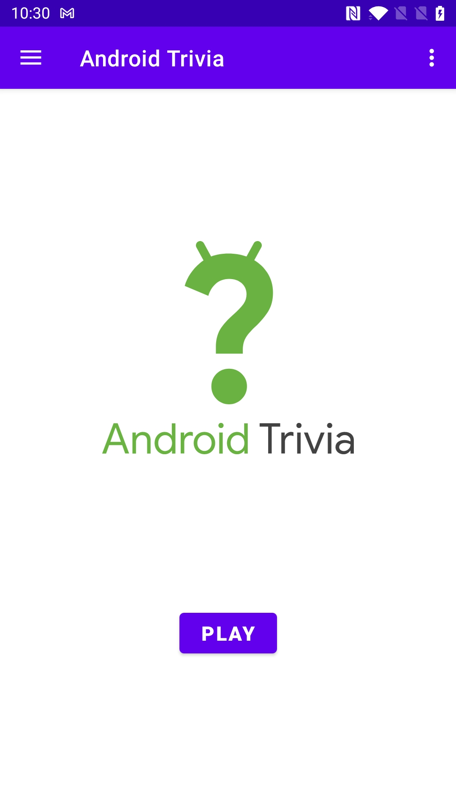 | 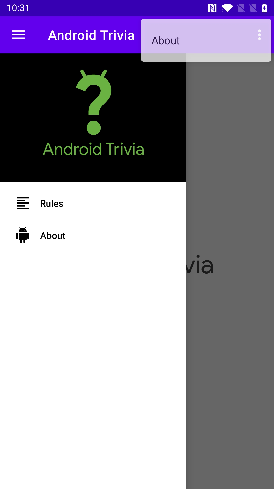 | 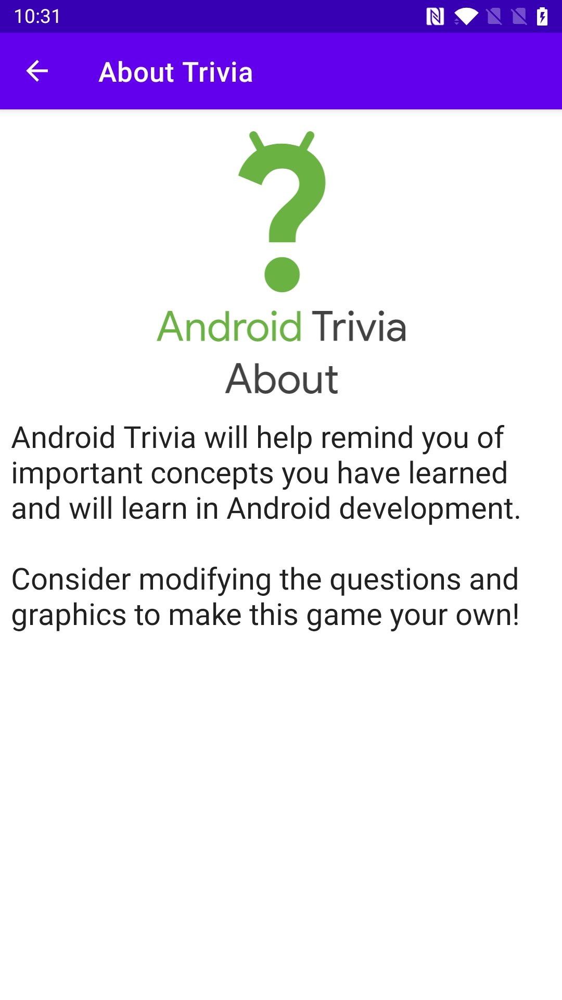 | 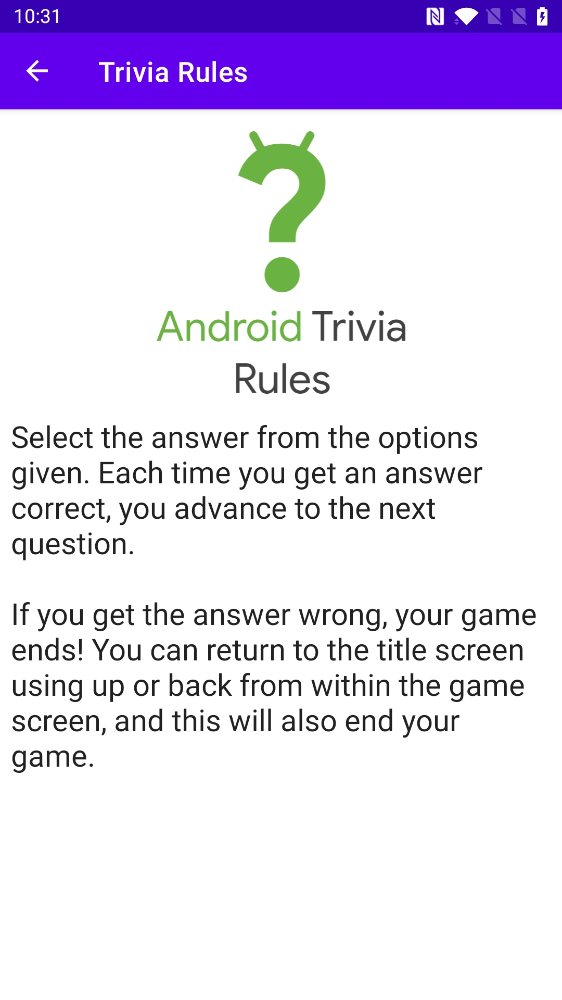 | 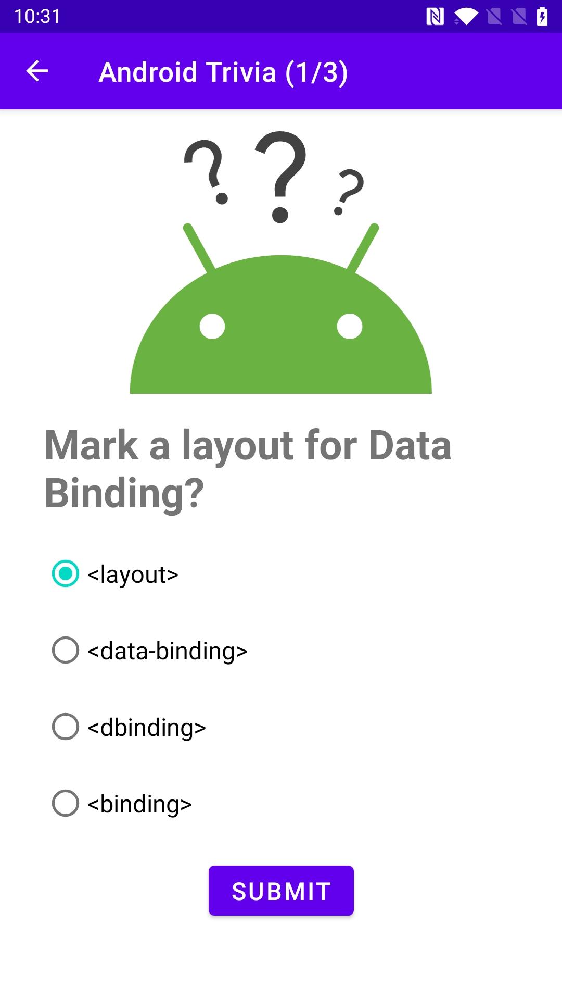 | 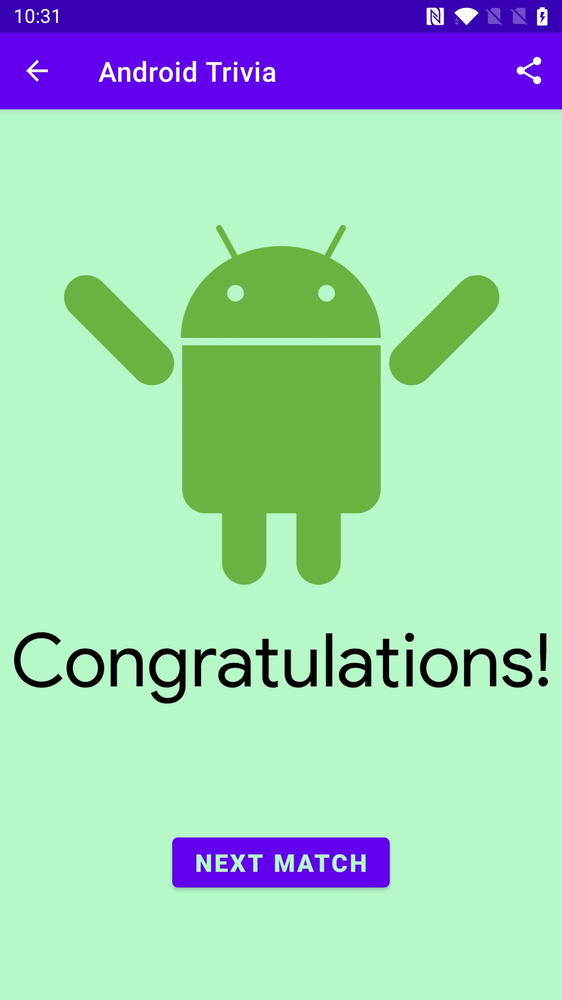 | 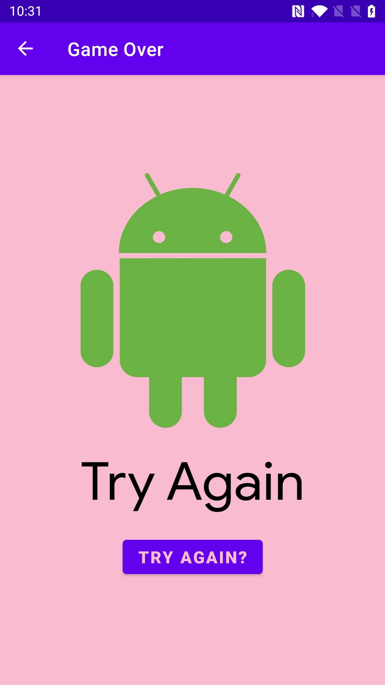
