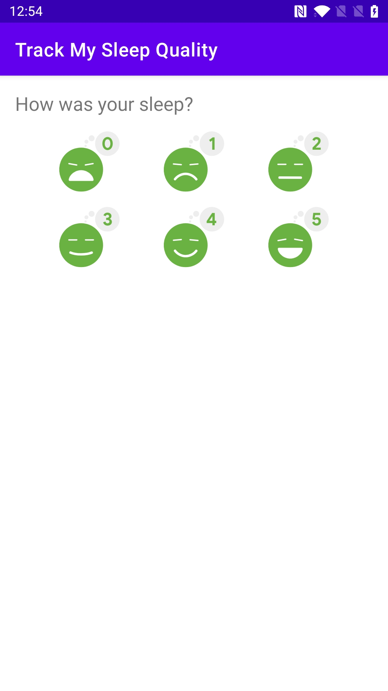
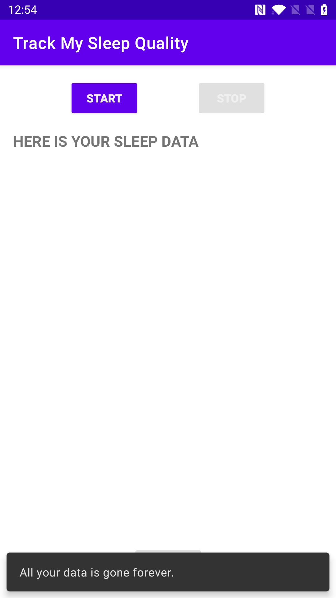
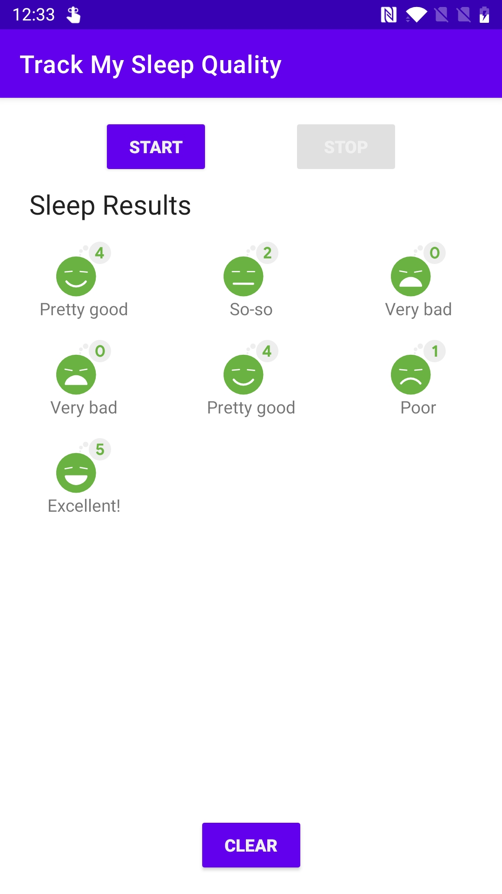

# Study Udacity

This project is for me to put everything I studied in this course: [Developing Android Apps with Kotlin by Google](https://www.udacity.com/course/developing-android-apps-with-kotlin--ud9012)

### Dice Roller
I developed an app called "Dice Roller", where it is an application that I roll 6-sided dice.

Dice Roller app start | Dice Roller app Roll
--- | ---
 | 

### About Me
I developed about Binding, styles and how to hide a keyboard in this app.
About Me edit text | About Me hide button and keyboard
--- | ---
 | 

### Color My Views
I designed my application with a good user experience called ColorMyViews, with basic UI layout design. and with the types of visualization in ConstraintLayout.
ColorMyViews start | ColorMyViews Colored | ColorMyViews Colored More
--- | --- | ---
 |  | 

### Trivia
I built a multi-screen Android app with the navigation library. This is a trivia app using various fragments and conditional navigations.
Trivia app start | Trivia app menus | Trivia app About | Trivia app Rules | Trivia app trivia | Trivia app Game Won | Trivia app Game Over
--- | --- | --- | --- | --- | --- | ---
 |  |  |  |  |  | 

### Dessert pusher
I understood the concept of Lifecycles for activities and fragments and developed this app called "Dessert Pusher".
Dessert Pusher | Dessert Pusher Donnuts | Dessert Pusher Email
--- | --- | ---
 |  | 

### Guess it
I developed the architecture components with ViewModel with LiveData to build this fun "Guess it" game.
Guess it | Guess it game | Guess it Play Again
--- | --- | ---
 |  | 

### Track My Sleep Quality 
I developed this application using data persistence with the Room class. This app, called "Track My Sleep Quality", is an app to help you track your sleep quality.
Track My Sleep Quality | Track My Sleep Quality start | Track My Sleep Quality stop | Track My Sleep Quality view | Track My Sleep Quality clean
--- | --- | --- | --- | ---
 |  |  |  | 

And I changed this app. I created a GridLayout and put the items in it, and I created another fragment to see the items when I click on each one.
Track My Sleep Quality | Track My Sleep Quality start | Track My Sleep Quality stop | Track My Sleep Quality view | Track My Sleep Quality item
--- | --- | --- | --- | ---
 |  |  |  | 

### Mars Real Estate
This app brings a list of images of mars land and its value for rent or sale. I created an app where I am using Retrofit to communicate with my API service, and I am also using Glide to display images from the web.
List of Rent or Sale | Sale detail | Rent detail | Menu list
--- | --- | --- | ---
 |  |  | 
